<div align="center">

<h3><code>arda@github ~ $ ./contributions.sh</code></h3>

<br/><br/>
<h3><code>arda@github ~ $ whoami</code></h3>
<table>
<tr>
<td valign="top"></td>
<td valign="top"></td>
</tr>
</table>
<br/>

```console
arda@github ~ $ stack --list
python · playwright · selenium · tkinter · sqlite · electron · git · vscode
```

<!-- langs:start -->
```console
arda@github ~ $ lang --top
Python       █████████████████░░░   85%
JavaScript   █░░░░░░░░░░░░░░░░░░░    5%
TypeScript   █░░░░░░░░░░░░░░░░░░░    5%
Other        █░░░░░░░░░░░░░░░░░░░    5%
```
<!-- langs:end -->

```console
arda@github ~ $ ls ~/projects --top
```

| repo | what it does |
|---|---|
| [kdv-capraz-kontrol](https://github.com/ArdaEkiz0/kdv-capraz-kontrol) ★ 3 | Cross-checks e-Invoice (XML), PDF and Excel invoices against VAT control tables |
| [luca-mizan-otomasyon](https://github.com/ArdaEkiz0/luca-mizan-otomasyon) | Trial-balance report automation for the Luca accounting suite |
| [e-kesinti-otomasyon](https://github.com/ArdaEkiz0/e-kesinti-otomasyon) | Automates SGK agricultural deduction filings from Excel |
| [finansal-hesaplayici](https://github.com/ArdaEkiz0/finansal-hesaplayici) | Desktop Turkish financial calculator (Electron) |

```console
arda@github ~ $ cat contact.txt
github.com/ArdaEkiz0 · linkedin.com/in/arda-mehmet-ekiz-107640333
```
</div>
